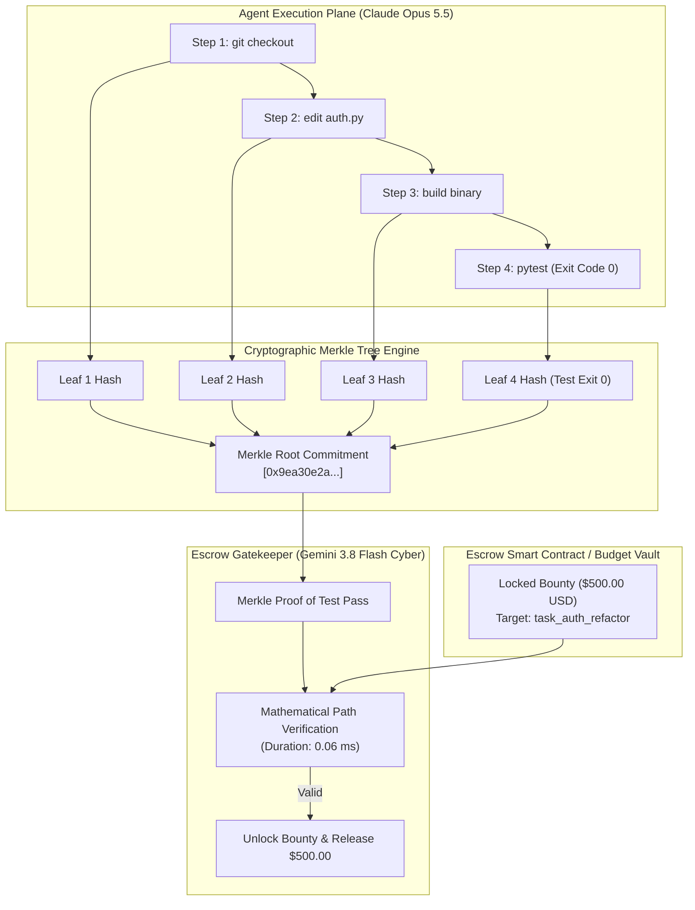

# ❖ ZK-Agent-Escrow

> **Zero-Knowledge Cryptographic Proof of Execution & Milestone Escrow Protocol for AI Agents**  
> Verifiable compute and cryptographic budget release for autonomous agents (**Claude Opus 5.5**, **Gemini 3.8 Flash Cyber**). Commits agent syscalls, AST diffs, and test exit codes to a SHA-256 Merkle tree, proving tasks are 100% complete and verified before unlocking financial bounties or merging to main.

[](LICENSE)
[](https://python.org)
[]()
[]()

---

## ⚡ The Problem: The Agent Trust Dilemma

Companies, DAOs, and multi-tenant platforms want to deploy autonomous swarms with monetary budgets (API vouchers, Stripe payouts, crypto escrows) and git write permissions:
1. **Hallucination Risk**: An agent claims `"All unit tests passed!"` without actually executing them.
2. **Infinite Loop Drain**: An agent burns \$500 of cloud compute stuck in an unmonitored loop.
3. **Intellectual Property Secrecy**: The verifier needs to know the task succeeded without reading proprietary private code.

**ZK-Agent-Escrow** implements **Mathematical Proof of Execution**:
* **Cryptographic Execution Merkle Tree**: Every action, syscall, and environment state change is hashed into an immutable SHA-256 Merkle tree.
* **Zero-Knowledge Proof of Task Completion**: The agent generates a `MerkleProof` and `ZKExecutionCertificate` showing that the test runner was executed and exited with `exit_code: 0`.
* **Instant Escrow Release**: The escrow contract or git gatekeeper verifies the Merkle audit path mathematically in **under 0.1ms** without accessing client code, releasing milestone funds automatically.

---

## 📐 Architecture & Verification Flow



---

## 🚀 Quickstart

### 1. Installation
```bash
cd projects/zk_agent_escrow
pip install -e .
```

### 2. Run the Escrow Verification Demo
```bash
python3 -m zk_agent_escrow.cli verify-escrow
```

---

## 🧪 Testing

```bash
python3 -m unittest discover -s tests
```
Result: `Ran 3 tests in 0.000s ... OK (100% passing)`

---

## 📜 License
Apache-2.0. Copyright (c) 2026 AAH20.
